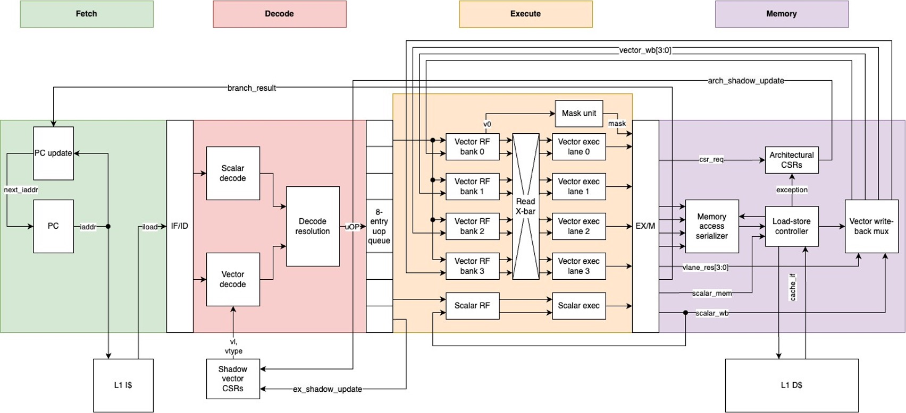
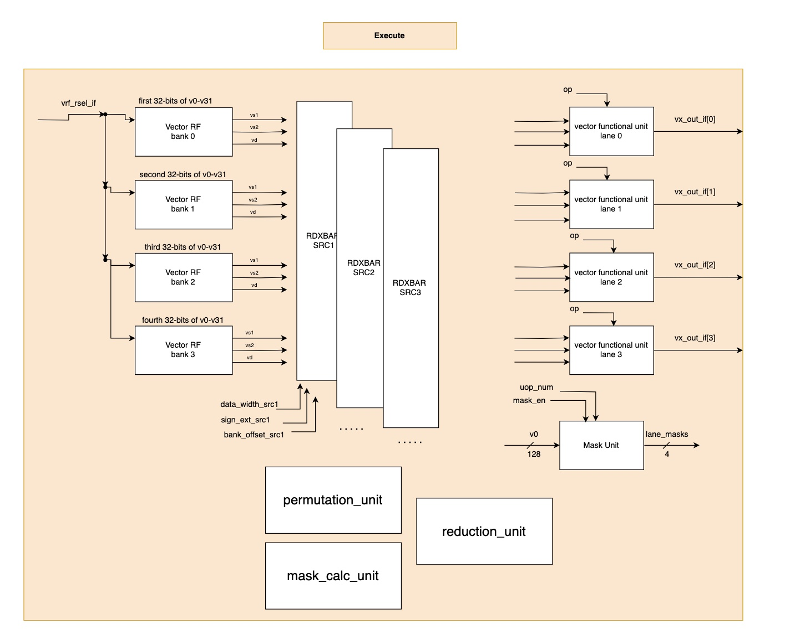
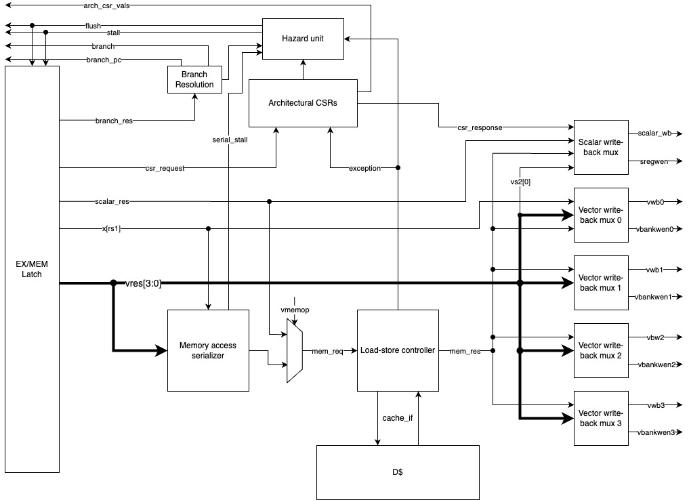
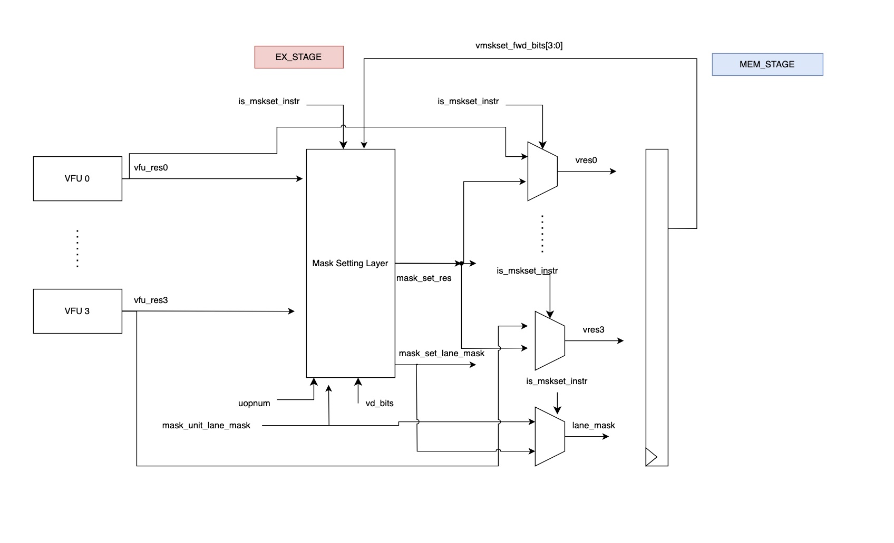
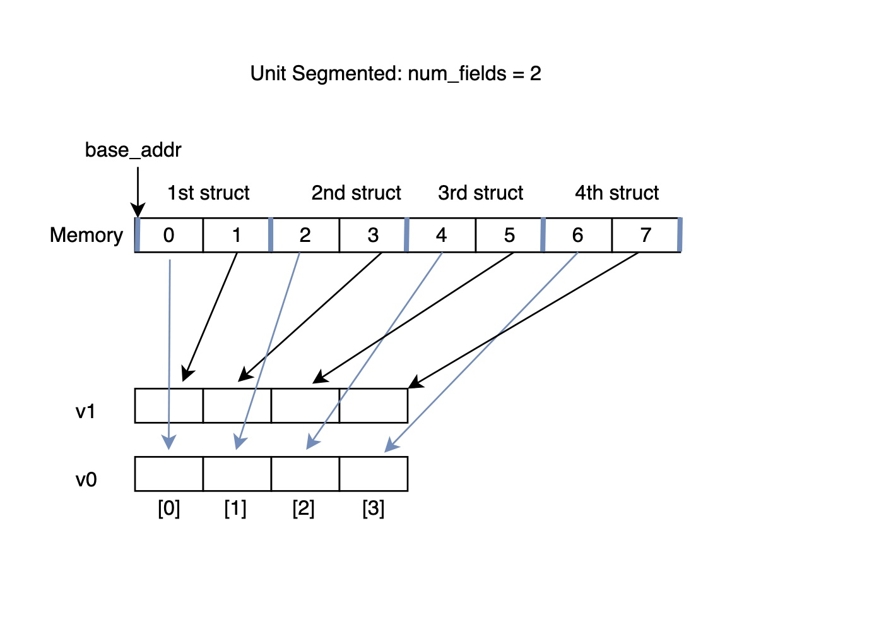

# Microarchitecture

In this document we delve into more detail about the decode, execute, and memory pipeline stages in the following top-level diagram of our processor: 

## Decode Stage 

## Execute Stage 

Below is a more detailed diagram of what is hapenning in the execute stage. We omit details about the datapath for scalar instructions, since those were not affected by the vector extension. 

The execute datapath is able to handle 4 parallel operations every clock cycle. In order to sustain this throughput, we have partitioned our datapath for vector instructions in 4 lanes. However those lanes have a lot of intercommunication with one another, particularly when reading operands. The source file deadling with constructing this datapath is in *source_code/rv32v/rv32v_ex_datapath.sv*. 

The vector register file contains 32 vector registers where the size of each vector register is 128-bits. This register file is banked across 4 banks, where the each 32-bit segment of a vector register resides in a different bank. Since vector operations can work on 8-bit, 16-bit, or 32-bit elements, some vector operations can have three operands, and the different operands can have a different data-width, we add three read crossbars. Those read crossbars read data from the all the banks, take into account the data-width of the operand and the bank where one should get the data from, and then generate the appropriate data to send to each of the 4 vector functional units when it comes to that particular operand. 

Instructions that require reading a third operand have that third operand being the vector destination register. That is why in the diagram, it shows reading vd from the register banks. 

To support masking element operations, we generate 4 mask bits in the excute stage with 1 bit corresponding to each mask. Those bits are used in the memory stage to mask element writeback or memory accesses. 

Certain vector instructions have an a value coming from the scalar register file or an immediate field in the instruction serving as one the operands. To handle this, muxes are added at the inputs of the vector functional units. 

This datapath handles most of the vector instructions, however certain instructions require different handling. For instance some masking instructions like *vcpop, vfirst, vmsbf, etc.* have their own dedicate mask_calc_unit in *source_code/rv32v/source/rv32v_mask_calc.sv*. The same goes for reductions and permutations. 

## Memory Stage

Block diagram of our processor's memory stage.

At a high level, the memory (mem) stage handles memory accesses, register file writeback, branch resolution, and reads and writes to the architectural CSRs.

### Memory Access Serializer

Since we have 4 vector lanes, with each potentially having an active memory request, these memory accesses are serialized, starting from lane 0. Currently on a vector memory access, the serializer iterates over each lane, forming a request for the load-store controller. Once one lane's access is complete, it moves onto the next lane.

For indexed loads and stores, the serializer simply passes the calculated address onto the load-store controller, but in the case of a strided access, it uses an internal accumulator to compute the address which is initially set to the base address and accumulates a 'stride' for every element in the instruction.

Our implementation only supports vector element-aligned accesses.

### Load-Store Controller

The load-store controller interacts with the L1 data cache. Upon a memory access, it is given a request which is muxed between scalar memory signals and the vector memory access serializer depending on the instruction type and signals that it is busy. Upon completion of a load, it allows the data to be written back to a register. If the memory access is malformed or attempts to R/W to a protected region, it raises an exception to the hazard unit and CSRs for handling of the exception.

> This and the serializer are great candidates for future optimization as memory accesses are our core's primary performance bottleneck. Vector memory access coalescing would be a good start especially for the ovbious unit-strided case. Another potential is widening the cache access to block size. However, note that the PMP registers can be configured with NA4 (naturally aligned 4-byte region), so this will need to be considered before just blidnly pulling up or modifying the whole cache block.

### Writeback 'Gather' Crossbar/Muxes

As we use a read 'scatter' crossbar in execute to schedule elements out to the 4 vector lanes depending on the SEW and micro-op/bank-offset, we use a 'gather' writeback crossbar to write result elements back to their appropriate registers. There is one mux per vector register bank, each seeing all 4 lanes' results and using the destination EEW and bank-offset to determine which lane(s)' elements are to be written back to it's bank.

### Architectural CSRs

Since instructions that reach the memory stage are guaranteed to be non-speculative, the architectural CSRs are written to and read from here. With respect to vector CSRs and the shadow copy in decode, upon a branch mispredict, the shadow CSRs are set to the known architectural values from these CSRs.

Aside from an explicit write to the `vstart` CSR, it is updated on other conditions here:
* When a vector instruction completes, it is reset to 0. In the case of memory accesses, this is when the last element completes its access.
* Upon an exception, it is set to the excepting element number.
* Upon an interrupt, it is set to `max(vstart,n)` where `n` is the element number of the first element that has not yet been completed / written-back.
* There are certain instructions that if interrupted, cannot be restarted from an arbitrary `vstart` value, either as defined by the specification or required by our implementation. In this case, it remains unchanged on an interrupt.

### Hazard Unit

The hazard unit is responsible for tracking and resolving hazards, exceptions, and interrupts. This is done across all stages, but especially in the memory stage, the only place where exceptions can occur and where every instruction is non-speculative. Our vector implementation does not support general forwarding as it is largely unnecessary between micro-ops for any `vl > 4`. So, if a vector register-file hazard is detected, the hazard unit stalls the execute stage until the data is written-back. The hazard unit also communicates with the CSRs by, for example, indicating when to set `vstart` and to what value.

### Branch Resolution

Branch instructions are resolved here. If a branch was mispredicted, then once it reaches the mem stage, the pipeline is flushed and the correct PC is set. As of SP24, the branch predictor is always-not-taken.

### Interrupts and Exception Handling

Upon an exception, the pipeline is immediately flushed and the exception is handled. An interrupt that occurs during a non-memory access is also taken immediately. However, if an interrupt occurs during a memory access, then the current scalar access or vector element access is allowed to complete before the interrupt is acknowledged by the pipeline and then taken.

> Note: Our current implementation does not implement fault-only first vector memory instructions properly. They are treated as regular accesses where any element can cause an exception upon which the exception handler is jumped to. Instead, the spec says the only the first element can cause an exception to be taken with an exception on a later element setting `vl` and finishing.

## Complex Instructions 

### Reductions

### Permutations

The permutation unit is a cross-lane unit that reads operands and sets the result for all 4 lanes. It is stateful, multi-cycle in numerous cases, and extensively uses the scratch register for computations. For example, the scratch register is used by `vslide{1}{up,down}` instructions to store and have access to elements read out of the register-file by previous micro-ops. It is also used by `vrgather` to store the source register and bank of each element it will access in `vs2` from the indices given by `vs1` and then to store the values read from `vs2` before they are written-back.

The permutation unit is also able to overwrite the current `vs2` and `bank_offset` signals that are fed into the register banks and read crossbar in the case of `vrgather` in particular but this functionality is also used by the vector slide instructions in some cases. This allows the permutation unit to read out arbitrary elements as required by `vrgather`.

### Mask Setting Instructions 
Some vector instructions write on the granularity of individual bits. Examples of these instructions include the vector comparison instructions like *vmslt.vv* where each comparison either writes a 0 bit or a 1 bit in the destination vector register. In these instructions, we generate 4 bits in the execute stage (since where are doing 4 parallel comparisons) that we send to the memory stage for writeback. However, the lowest granularity that we can write to a vector register is 1 byte or 8-bits. To deal with this we have the following logic in the execute stage: 

. 

Before we pass inputs to the mem stage latch, we have a mask set layer that adjusts those input values for mask setting instructions as shown by the *is_mskset_instr* signal in the above diagram. For mask setting instructions, only the least signficant bit from the VFU (vector functional unit) is relevant. We pack those 4 bits (the LSB from each VFU) in the mask set layer to be sent in the *vres{x}* signals. In the case where the uop in the execute stage is writing to bits 4-7 of a vector register, we do not want to overwrite the previous 4 bits we generated in the previous cycle. This is why we forward 4 bits from the mem stage to the execute stage to use as needed. In the mask set layer, we also end up needing to overwrite the lane_mask signals, the bank_offset signals, along with other signals before sending them to the mem stage. The source file deadling with the mask set layer is in *source_code/rv32v/source/mask_set_layer.sv*. 

### Segmented Memory Instructions  
Segmented memory operations are dealt differently with when compared to other types of vector memory operations. For instance with unit-strided, strided, and indexed vector memory operations, 4 memory accesess are sent in 1 uop where they are serialized in the mem stage. For segmented memory operations, each uop only deals with 1 memory access. 

Segmented load/store instructions are used for loading/storing arrays of structs. Below is an example of a unit-strided segmented load where each struct in the struct array is composed of two fields: 

These memory instructions are primarly dealt with in the decode stage when we are generating uops. A different set of counters are used in the uop generation unit in *source_code/rv32v/source/rv32v_uop_gen.sv* to handling decoding these instructions. Each uop only deals with 1 memory access, and we performs memory accesses in order. We access the segments in order as well as the fields within each segment. 

