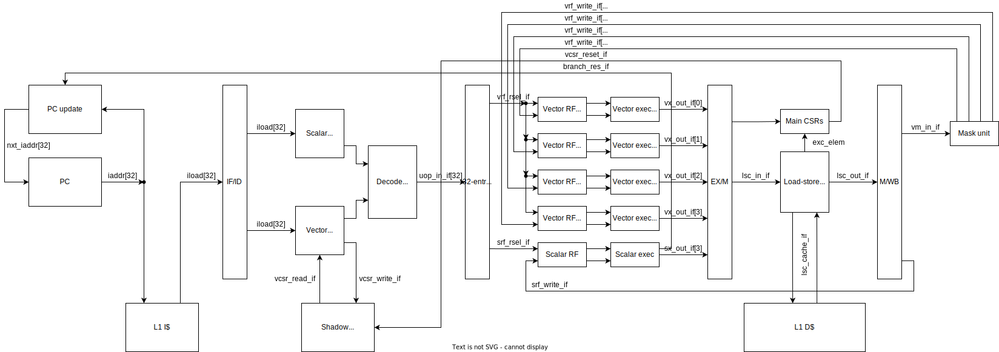

# RISC-V Vector Extension Project Overview

## Introduction

This project involves the integration of the RISC-V "V" Vector Extension into SoCET's RISC-V core. The primary goal of this project is to implement all instructions in the Zve32x standard vector extension such that the processor is able to run vectorized code generated by standard compilers such as Clang or GCC with a significant performance uplift over the base processor in parallelizable applications. This has to be done while keeping area and power in check, and while ensuring that the design is verifiable, maintainable, and extendable by SoCET moving forward.

## Background

The RISC-V "V" Vector Extension (henceforth referred to as "RVV") is a new RISC-V spec that adds vector processing capability to the base ISA. It introduces instructions for performing integer, fixed point, and floating point operations on vectors of elements of up to 64 bits each. This extension uses an interesting approach to handling vector lengths, somewhat similar to Arm's SVE. The vector lengths are dynamically computed at runtime based on the hardware's vector register size and execution capabilities instead of being fixed as they are in "traditional" vector ISAs such as AVX and NEON. This, along with automatic masking of tail elements when the vector length is smaller than a vector register, makes writing vector code really easy for assembly programmers and compiler writers. However, this does mean that the hardware is responsible for dealing with a lot of the bookkeeping, which adds complexity to the design and makes our lives significantly harder.

The spec defines a set of standard vector extensions, out of which this project implements the Zve32x extension. This extension requires support for a maximum element size of 32 bits, and requires implementing all vector instructions other than floating point instructions as well as precise traps. In the future, it would be relatively easy to extend this design to support the Zve32f extension, which adds support for floating point operations.

## Architecture

Below is a high-level overview of our proposed pipeline architecture.

The architecture is largely derived from the 3-stage pipeline used on AFTx07, with the major addition of a uop queue in between the instruction decode and execute logic. This allows us to split long vector operations into smaller uops that can be natively executed by our 4-wide vector execute stage. All instructions whether scalar or vector share the pipeline and stay strictly in order to minimize complexity. The load store controller serializes accesses to the cache to allow us to handle wide vector operations with our single-ported cache. We add a shadow copy of the vector CSRs in the decode stage to ensure that changes made by `vset*` instructions get immediately reflected in the vector instructions following them without requiring a stall. The shadow copy is overwritten by the primary CSRs in the mem stage whenever there is a pipeline flush.

The design uses a 128-bit wide vector register file split into 4 32-bit wide banks. These feed 4 vector execution lane through a crossbar, each of which is capable of performing various vector operations at a native width of 32 bits. To support sub-word and mixed-width operations, the read crossbar shifts and masks the data coming from the vector register banks to allow reuse of the native-width functional units, and the reverse operation is applied during writeback.

## Software

We have verified that we are able to generate vectorized code using the latest version of Clang/LLVM. GCC is in the process of adding auto-vectorization support for RVV, but the changes have not been merged into the mainline releases as of May 2024. We were able to compile simple benchmarks based on data-parallel workloads using GCC and Clang, and were able to observe vector code generation and large performance increases over scalar versions of the same code.

Unfortunately, while we are able to compile Embench with vectorization enabled, the hot loops in the benchmarks end up not being vectorized. At least in the case of matrix multiplication, this appears to be due to potential pointer aliasing, and unfortunately there is no way for us to fix that issue without changing the benchmark code, which would sort of defeat the purpose of running a standardized benchmark suite in the first place.

For more information on compilers and software, refer to our [Compilers documentation](rv32v_compilers.md).

## Status
As of May 2024, the base design is fully implemented and reasonably well verified. All instructions have been implemented with the exception of fixed-point instructions, which we elected to skip since compilers will never generate them and fixed-point operations are easily emulated in software.

Additionally, the fault-only first load/store instructions aren't properly implemented, since they may fault on any access, not just the first. In practice, we don't expect this to be an issue since again, compilers won't generate this instructions and the behavior can probably be easily emulated in the exception handler.

We have run several compiled microbenchmarks to test performance on embedded data-parallel applications. We see an uplift over 60% in most data-parallel workloads, with some workloads that have lower memory intensity showing speedups as high as 175%. Our assessment is that the primary bottleneck is accessing memory, since currently all accesses are serialized through a single memory port. Additionally, smaller element sizes still take an entire vector lane even though the lanes themselves are technically capable of processing 32 bits, and thus should be able to handle multiple smaller-sized elements with minor modifications.

We also ran the Skywater 130 PDK synthesis flow made by the design flow team on both our updated core as well as the old 3-stage core. We found that frequency of both designs was comparable, while the vector design consumed around 60% more logic area when including the entire SoC. When isolating just the core pipeline, the increase in area was around 3.5x. While these area increases are significant, they are still quite manageable, especially when considering the size of the FFRAM on AFTx07.

## Future Work

While we have made our best effort to verify correctness of the design as much as possible, there is still a lot more verification that needs to take place. Specifically, testing of edge cases, especially with interrupts and exceptions, is something that we anticipate could reveal more bugs.

In order of expected impact, potential performance optimizations are:
- Memory access coalescing
- Wider data cache port
- SIMD functional units
- Pipelined multiplier/divider
- Decode multiple micro-ops per cycle

Additionally, future projects could also look into reducing area by combining multipliers and dividers across lanes and across functional units. Vector instructions could maintain performance by pipelining the multipliers and dividers such that the entire pipeline is still 4-stage, but multiple vector ops could be in flight in the execute stage at the same time on a single functional unit. This would decrease area while maintaining frequency and performance for both scalar and vector instructions.

Finally, a larger project may be to simple make scalar instructions issue on a given vector execution lane, thus eliminating the isolated scalar pipeline entirely. One could even envision allowing superscalar issue of independent scalar instructions from the micro-op queue into different lanes, increasing performance further.

## Contributors

- Fahad Aloufi (faloufi@purdue.edu)
- Max Michalec (michalem@purdue.edu)
- Om Gupta (guptao@purdue.edu)
