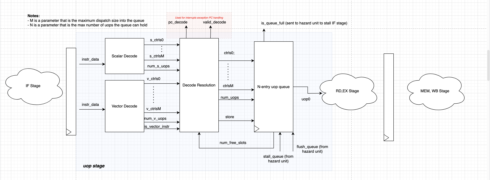
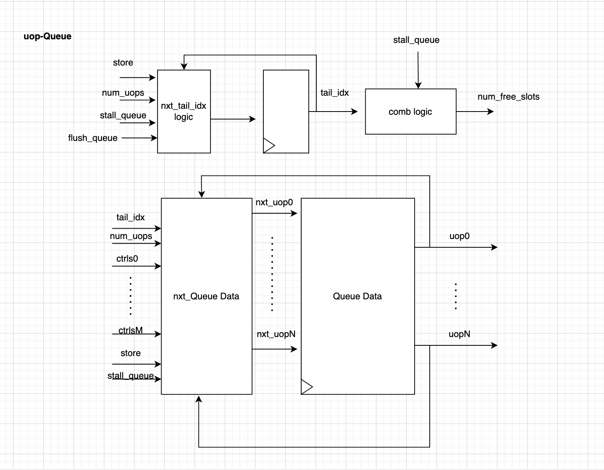

# Micro-Op Queue Design

## Introduction

Our strategy for handling complicated instructions or instructions that operate on more than 4 pairs of data is through breaking an instruction in multiple smaller instuctions called 'uops.' To accomplish we need a uop queue block to hold instructions as well as a decode resolution block to arbirtrate between the outputs of a scalar decode block and our own vector decode block which will be working parallel.   

## Design Overview 
Below is the current architecture for our decode-uop stage in our pipeline. 

We can see that that we have two seperate decode blocks for scalar instructions as well as for vector instructions. Because we have two decode ouputs, we need a decode resolution stage that is informed to pass the output of the vector decode stage if the *is_vector_instr* flag from the vector decode stage is asserted. 

The decode resolution signals then pass into a micro-op queue by asserting the store signal **only if there is enough room for all of the uops as indicated by the *num_uops* signal**

Also blocks in the decode-uop stage are fully combinational except for the uop queue which has the design below. 

There is a tail_idx counter that keeps track of the last active element in the queue, and the uops are stored in registers  

The uop-queue and decode resolution blocks are also fully parametrizable with the following parameters:
-  **D_TYPE** - Data structure for the uops in the queue
- **QUEUE_LEN** - Maximum number of elements the queue can hold. 
- **DISPATCH_SIZE** - Maximum number of uops to be dispatched in one cycle. 

