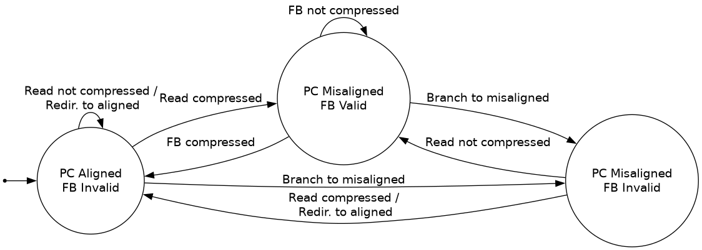
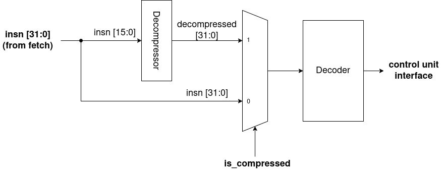

# RV32C

The RV32C extension allows some common instructions to be expressed as a 16b instruction. These 16b instructions may be freely mixed with 32b instructions. 

## Implementation Status
Currently, the implementation covers the "C" extension, including the "Zfa" and
"Zfd" floating-point subsets (decode-only). "Zcb" will be implemented in the near future.

The implementation is split into 2 components: the fetch buffer and the decompressor. 

## Fetch Buffer
The fetch buffer (FB) sits in front of the I$. It has 2 functions: 
1. Determine the next fetch address. The I$ supports only aligned 32b accesses, so the fetch buffer translates misaligned PC to the aligned address of the relevant data.
2. Buffer unused data. If an I$ fetch yields a compressed instruction, the remaining 16b are buffered as they belong to either another compressed instruction, or are part of a full-size instruction.

The fetch buffer forms an FSM (Mealy machine) from the PC alignment (`pc[1]`) and the fetch buffer valid bit (`fb.valid`). The state transition diagram is as follows:

In this diagram, "read compressed" indicates the next instruction is a compressed instruction read from the I$. "FB compressed" means the next instruction is a compressed instruction that was held in the fetch buffer.

The initial state is "PC Aligned, FB Invalid". When in this state, reading full-width instructions will simply pass on the full-width value read from the I$ and remain in this state. Reading a compressed instruction will transition to "PC Misaligned, FB Valid", the bits comprising the compressed instruction are passed on, and the unused bits of the 32b read will be placed in the FB. 

In the "PC Misaligned, FB Valid" state, if the FB content is another compressed instruction, the next fetch won't read from memory. Instead, it passes on the FB value as the instruction and transitions back to "PC Misaligned, FB Invalid". Otherwise, if the FB contains part of a 32b instruction, the next aligned 32b word is fetched. The FB content and lower 16 bits of the fetched data are concatenated to form the misaligned 32b instruction that is passed on; the upper bits of the fetched data become the new FB content, resulting in staying in the "PC Aligned, FB Invalid" state. 

In the above cases, the FB incurs no extra latency in the pipeline. 

The remaining state is the "PC Misaligned, FB Invalid", which can only be reached via control flow to a misaligned address (which invalidates the FB). In this state, the upper 16 bits of the fetched word are relevant. If these bits are a compressed instruction, then the state will transition to "PC Aligned, FB Invalid". If the bits are part of a 32b misaligned instruction, they must be buffered and no instruction will be passed on to the next stage this cycle, creating a pipeline bubble (unavoidable due to data spanning 2 aligned 4B fetches). The state will transition to "PC Misaligned, FB Valid" where instructions will resume as normal operation.

Note that the 4th combination, a valid fetch buffer and aligned PC, is not possible.

## Decompressor
As all implemented instructions are 1:1 with full-sized instructions, the decompressor simply sits in front of the normal decoder. The decompressor takes in 16b of an instruction and outputs the corresponding 32b instruction, which is in turn fed to the standard decoder.

In the pipeline, the decompressor sits between the 32b instruction (from the fetch stage) and the decoder. It takes in the lower 16 bits of the data and outputs the 32b decompressed value. A multiplexor on the decoder selects between the full 32b value from the fetch stage, and the 32b value produced by the decompressor. This selection is determined by the lower two bits of the instruction; the pattern 2'b11 indicates a full-sized instruction.
