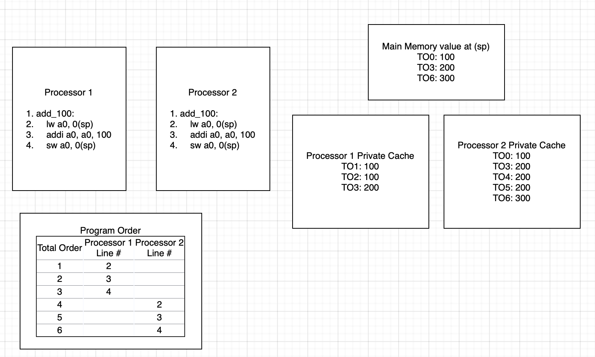

# Multicore

A multicore design is a type of multiprocessing in which multiple cores are
used to run programs in parallel. This is sometimes referred to as chip
multiprocessing (CMP). Multicore designs generally offer greater performance at
the cost of power and area.

## Heterogenous Multicore

A heterogenous multicore system uses disparate core designs and features to
provide multiprocessing. This allows for greater task level parallelism without
the power and area overhead that a homogenous design requires. Currently,
a dual-core big/little design is planned.

### Planned heterogenous core features

- [ ] 3 stage pipeline RV32IMACV big core
- [ ] 2 stage pipeline RV32EAC little core

## Current architecture plan for the Dual-core processor with MESI Coherence

## Cache coherence

Incoherency can arise when programs acting on shared memory execute on a system
using private caches which do not synchronize with each other. An example of
this is shown below. Total program order in the example below is used to
sequentialize operations occuring in parallel. Both processors are running the
same program which loads a global variable, adds 100 to it, and then stores it
back to memory. Initially, processor 2 has the value at `0(sp)` in its cache.
Processor 1 loads in `0(sp)` into its cache and the `a0` register. It then adds
100 to `a0` which brings its value to 200. Finally, it stores the value back to
the same address of `0(sp)`. However, this causes an incoherence in the caches
of processors 1 and 2 because the value in processor 2's cache is still 100.
Processor 2 then loads the value of 100 from its cache into its `a0` register.
It then adds 100 to it, and again stores it back to memory.

An example of coherent system running the same program is shown below. The
runtime state is mostly the same until total program order 3 in which processor
1 stores 200 to `0(sp)`. When this happens, this also updates the value in
processor 2's cache to 200. Then, when it loads the value from memory in total
program order 4, it loads the updated value of 200 to its `a0` register. Then,
when it adds 100 to it and stores it, it stores the correct value of 300.

## Cache Modifications

To enable coherency and atomics, a reservation set register, a duplicate SRAM tag array, 
and a coherency interface were added to each L1 cache. Each cache is connected to an atomicity 
unit that handles bus transactions. This is intended to reduce the complexity of 
the cache and allows other cache designs to be used with few coherency-related modifications.

The coherency interface grants read-only access to the duplicate SRAM array to the bus.
This allows the bus to compare tags when snooping without interrupting the cache. The bus
only gains access to the cache's SRAM data array if a snoop hit occurs, causing the cache
FSM to enter a snooping state. The signals provided by the coherency interface, bus_ctrl_if,
are available in the source_code/include/bus_ctrl_if.

Currently, the duplicate SRAM array contains both the data and the tags. This duplicate
data is not used, so the extra SRAM cells used to store them will need to be removed.
Additionally, the seperate_caches.sv file in the source_code/caches/ directory can be
modified to use a cache without coherency for the Icache. At present, both the Dcache and
Icache use the same L1 module.

## Atomics

Atomic instructions can be used to provide memory ordering and ensure that
a read-modify-write operation occurs as a single instruction. Memory ordering
restrictions can be used to ensure whether or not certain instructions can be
observed to have taken place by the time the atomic instruction executes. The
table below briefly covers the semantics behind each ordering. Furthermore,
a store-acquire or load-release operation would be semantically meaningless due
to how data dependencies could be observed. It does not matter if a store is
done with acquire semantics because stores in atomic contexts are used for
ordering with respect to a previous load-acquire. Similarly, a load-release is
nonsensical because it is not useful to have execution continue based off of
future loads/stores.

A simple mental model which can be used to understand these orderings is how
they would be used in a mutex. For example, when acquiring a mutex, we want all
previous state to have completed so that the critical path relies on the most
up to date information. When releasing the mutex, we want anyone who depends on
the data behind the mutex to have the most up to date data from the execution
of the critical path.

| Memory Ordering          | Description                                                                                                                                                                        |
| ------------------------ | ---------------------------------------------------------------------------------------------------------------------------------------------------------------------------------- |
| Relaxed                  | No ordering with respect to any other loads occurs.                                                                                                                                |
| Acquire (acq)            | Ensures that no following memory operations can be observed to have happened before this operation.                                                                                |
| Release (rel)            | Ensures that all previous memory operations must be observed to have happened before this operation.                                                                               |
| Acquire-Release (acqrel) | Ensures that all previous memory operations must be observed, and no following memory operations can be observed to have happened before this operation (sequentially consistent). |

It should be noted that these orderings are mostly relevant for out-of-order
cores or for cores with out of order load-store queues. The current core is an
in-order pipeline with no load-store queue therefore there is no support needed
for these orderings.

### Hardware atomics

Hardware atomics are planned to be implemented through a `LRX`, `SC_AND_OP`
microop execution sequence. The `LRX` microinstruction will be used to perform
a load-reserved with an exclusive bit set which would block any other
transactions on that cache line. The `SC_AND_OP` microinstruction would use the
results from the free ALU to be used as the store value the memory stage. As
with all `SC`'s, this clears the reservation set on that cache line.

Another interesting architecture is to attach an atomic unit to the bus,
however, this would likely be unnecessary for our small scale dual core system.
[Information on this architecture can be found
here](https://ieeexplore.ieee.org/document/9218661).

### Software emulated atomics

Because `LR`/`SC` are the basic building blocks of all atomic instructions,
a tight loop consisting of an `LR`, operation, and `SC` can be used to emulate
any AMO. An `LR` can be followed by a sequence of instructions to emulate the
effects of an AMO, which is then followed by an `SC` and a conditional jump
back to the `LR` can be used to retry the execution of an AMO until the `SC`
succeeds.

The core currently has support for the entire atomic instruction extension
through the use of the C routines in
`verification/asm-env/selfasm/c/amo_emu.c`. This file sets up an exception
handler for emulating atomic extension instructions in the case of illegal
instruction exceptions. The trap handler pushes all the registers to the stack,
decodes the instruction, executes it and updates the saved register on the
stack, then pops all the registers from the stack and returns. Support macros
for assembly usage are in `verification/asm-env/selfasm/amo_emu.h`. The
`WANT_AMO_EMU_SUPPORT` macro can be used to set up some support for the
C runtime including setting up the stack and exception handler. This allows for
trapping any encountered atomic instructions and emulating them using `LR`/`SC`
loops. This can be used as a stopgap until the hardware implementation of
atomics is completed.
