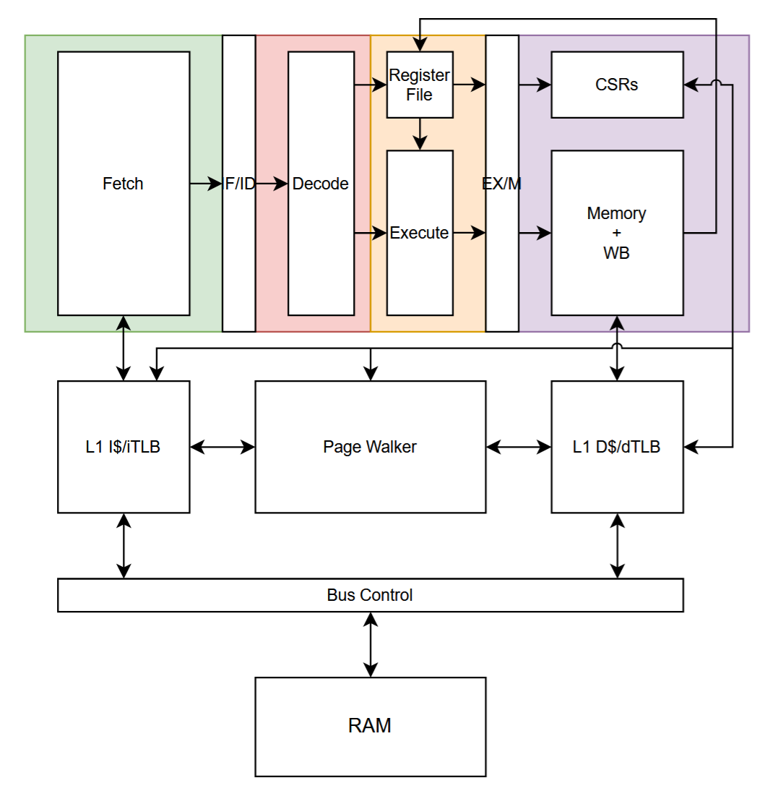

# RISCVBusiness Overview
RISCVBusiness is intended to be a configurable RV32 implementation targeting embedded applications. For information on the RISC-V Instruction Set Architecture, see the [RISC-V Ratified Specifications](https://riscv.org/specifications/ratified/).

Currently, the core supports the following features:
- Base ISA:
    - RV32I
    - RV32E (Reduced register count)
- ISA Extensions:
    - M
    - A
    - C
    - B
    - Zicsr
    - Zifencei
    - Zicond
- Privileged Architecture
    - Machine mode with 16 PMP regions
    - Supervisor with SV32 virtual addressing
    - User mode
- Microarchitectural Features
    - Dual core
    - 3-stage pipeline
    - Parameterized I/D Caches (coherent)
    - Parameterized I/D TLB
    - Branch prediction
    - Selectable multiplier implementation

Most of the features listed above can be tuned with a YAML file, see `example.yml` for an example of core configuration.

For planned features, see the [GitHub issues](https://github.com/Purdue-SoCET/RISCVBusiness/issues)

