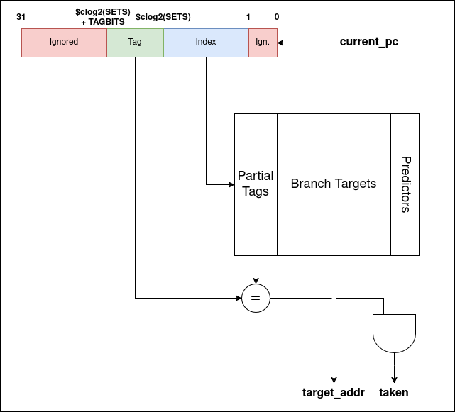
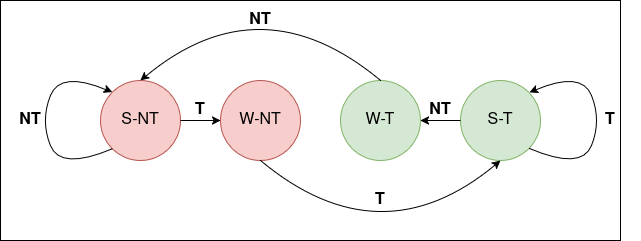

# Control Flow Prediction
RISCVBusiness features configurable predictors for various control flow. Currently, the core will attempt to predict branches, and experimental support for a return address stack predictor is available.

Future work will add prediction of direct and indirect jumps.

## Predictor Infrastructure
The predictors are all instantiated inside a wrapper file, which provides an interface to connect with the pipeline. The interface has two main components: the prediction and the update connections. These are given by the two modports in `predictor_pipeline_if.vh`, reproduced below.

### Predict side
```sv
  modport access(
    input predict_taken, target_addr,
    output current_pc, imm_sb, is_branch, is_jump, instr
  );
```
The `access` modport represents the connection between the predictor and the pipeline fetch stage.

| Signal | Width | Description |
|--------|-------|-------------|
| `current_pc` | 32b | Current fetch address |
| `imm_sb` | 12b | The branch-type immediate value. Only useful for `btfnt` predictor type. |
| `is_branch` | 1b | Indicates current instruction is a branch |
| `is_jump` | 1b | Indicates current instruction is a jump |
| `instr` | 32b | Full instruction. Used in prototyping RAS, will be removed. |
| `predict_taken` | 1b | High if predictor predicts 'taken' |
| `target_addr` | 32b | Prediction target; only valid if `predict_taken` high |

### Update side
```sv
  modport update(
    output update_predictor, branch_result,
           update_addr, pc_to_update, is_jalr,
           direction, prediction
  );
```
The modport `update` handles updating predictors with the true outcomes of control flow instructions. 
| Signal | Width | Description |
|--------|-------|-------------|
| `update_predictor` | 1b | Write enable for predictor |
| `branch_result` | 1b | True taken/not taken result |
| `update_addr` | 32b | True target of control flow instruction |
| `pc_to_update` | 32b | Address of resolved control flow instruction to update |
| `direction` | 1b | Indicates forwards/backwards branch. Used only for the `branch_tracker` |
| `prediction` | 1b | The originally predicted value. Used only for the `branch_tracker` |


## Predictor Types
Currently, the only fully-supported predictors are for branches. 

### Not Taken
The 'no-op' predictor, always outputs 'not taken'.

### Backwards Taken, Forwards Not Taken
A predictor that does what it says on the box. This incurs timing/area overhead due to calculating the target address in the fetch stage, derived from the instruction. It is not advised to use this for any implementation; it was used mostly as a comparison point when experiementing with more sophisticated techniques.

### BTB
The BTB predictor is a simple branch target cache augmented with up to 2 bits of dynamic predictor. The diagram below shows the BTB structure and read path; the write path functions identically, only it writes values for tags, targets, and updates the predictor according to the FSM.

The BTB size is parameterizable from the YAML file, which specifies the size of the BTB data in bytes. The BTB tag is also parameterizable, but is not yet exposed in the YAML file. It currently defaults to 8 bits of tag used to prevent aliasing.



The 2b predictor follows the classic state machine for simple dynamic prediction. The taken/not taken input comes from the `update` port and is the true branch outcome.



In the 1-bit configuration, the state machine instead simply updates to match the incoming branch update.

### (WIP) Return Predictor
A simple return address stack for predicting return instructions. 

The RISC-V spec gives a table of hints for when to push/pop the RAS (Section 2.5.1 "Unconditional Jumps") that this implementation attempts to follow.

## Branch Tracking
The module `trackers/branch_tracker.sv` contains a tracker that will log branch outcomes and print a file `stats.txt` after simulation completes that breaks down prediction accuracies for forward, backward, and total branches. The tracker is used by `bind`-ing it to the `predict_if` instance connected to the predictor wrapper.

This tracker can be extended for future implementation of jump and return prediction.
