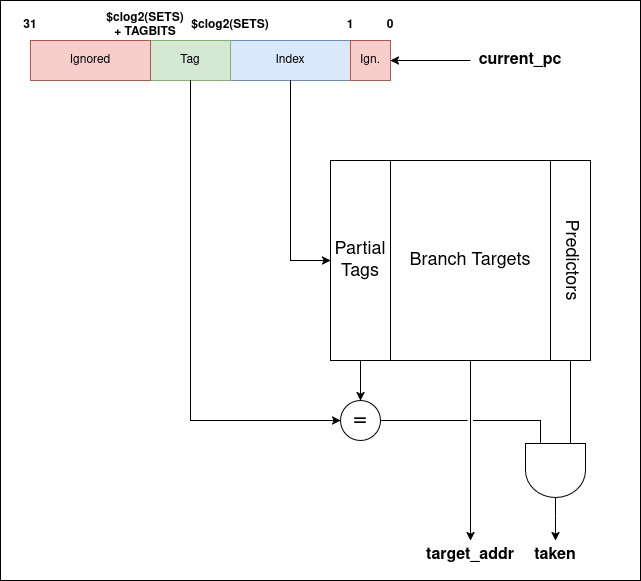
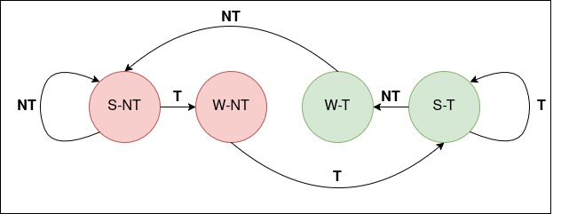

# Control Flow Prediction
RISCVBusiness features configurable predictors for various control flow. Currently, the core will attempt to predict branches, and experimental support for a return address stack predictor is available.

Future work will add prediction of indirect jumps, and more varieties of predictors for conditional branches and unconditional jumps.

## Predictor Infrastructure
The predictors are all instantiated inside a wrapper file, which provides an interface to connect with the pipeline. The interface has two main components: the prediction and the update connections. These are given by the two modports in `predictor_pipeline_if.vh`, reproduced below.

### Predict side
```sv
  modport access(
    input predict_taken, target_addr,
    output current_pc, imm_sb, is_branch, is_jump, instr
  );
```
The `access` modport represents the connection between the predictor and the pipeline fetch stage.

| Signal | Width | Description |
|--------|-------|-------------|
| `current_pc` | 32b | Current fetch address |
| `imm_sb` | 12b | The branch-type immediate value. Only useful for `btfnt` predictor type. |
| `is_branch` | 1b | Indicates current instruction is a branch |
| `is_jump` | 1b | Indicates current instruction is a jump |
| `instr` | 32b | Full instruction. Used in prototyping RAS, will be removed. |
| `predict_taken` | 1b | High if predictor predicts 'taken' |
| `target_addr` | 32b | Prediction target; only valid if `predict_taken` high |

### Update side
```sv
  modport update(
    output update_predictor, branch_result,
           update_addr, pc_to_update, is_jalr,
           direction, prediction
  );
```
The modport `update` handles updating predictors with the true outcomes of control flow instructions. 
| Signal | Width | Description |
|--------|-------|-------------|
| `update_predictor` | 1b | Write enable for predictor |
| `branch_result` | 1b | True taken/not taken result |
| `update_addr` | 32b | True target of control flow instruction |
| `pc_to_update` | 32b | Address of resolved control flow instruction to update |
| `direction` | 1b | Indicates forwards/backwards branch. Used only for the `branch_tracker` |
| `prediction` | 1b | The originally predicted value. Used only for the `branch_tracker` |


## Predictor Types
Currently, the only fully-supported predictors are for branches and unconditional jumps. 

### Not Taken
The 'no-op' predictor, always outputs 'not taken'.

### Backwards Taken, Forwards Not Taken
A predictor that does what it says on the box. This incurs timing/area overhead due to calculating the target address in the fetch stage, derived from the instruction. It is not advised to use this for any implementation; it was used mostly as a comparison point when experimenting with more sophisticated techniques.

### Branch Target Buffer (BTB)
The BTB predictor is a simple branch target cache augmented with up to 2 bits of dynamic predictor. The BTB is currently a *direct-mapped* cache, with size parameter `SETS` and number of tag bits parameter `TAGBITS`. Each BTB entry consists of a branch target address, the predictor FSM, and `TAGBITS` number of bits of partial tag to assist with aliasing.

The BTB size is parameterizable from the YAML file, which specifies the size of the BTB data in bytes (interpreted as bytes of target address, used to calculate `SETS`). The BTB tag size is also parameterizable, but is not yet exposed in the YAML file. It currently defaults to 8 bits of tag.



The diagram above shows the BTB structure and read path. The PC address is broken up into 4 fields (listed here as LSB to MSB): Bit 0 (ignored as RISC-V instructions are 2B-aligned); the index bits, consisting of `clog2(SETS)` number of bits starting at position 1; the partial tag, consisting of `TAGBITS` number of bits directly following the index; and the remaining bits, which are ignored. Note that `TAGBITS` may be 0, but `TAGBITS + clog2(SETS) + 1` must be less than or equal to 32. The BTB set is selected with the index field of the PC address. The associated predictor is checked, and the BTB makes a "taken" prediction if the predictor indicates the branch should be taken, and there is a match between the tag bits of the entry and the tag field of the PC input; otherwise, the BTB returns "not taken". When the branch is predicted "taken", the target address provided by the selected entry is used as the next PC value. 

The write path functions identically, only it uses the PC of the resolved branch instruction to select the entry, and writes values for tags, targets, and updates the predictor according to the FSM into the selected entry.


The taken/not taken input comes from the `update` port and is the true branch outcome.



The 2b predictor follows the classic state machine for simple dynamic prediction. It consists of Strong/Weak states for Taken and Not Taken predictions. A strong state saturates if it sees branch outcomes that match it, and move to a weak state if the outcome does not. For example, "Strong Taken" will remain if it sees a "Taken" branch, but move to "Weak Taken" seeing a "Not Taken" branch. A weak state will always transition to a strong state; for example, Weak-Not Taken seeing a "Taken" branch will transition to "Strong Taken", while seeing a "Not Taken" will transition to "Strong Not Taken". This is to prevent oscillating between "Weak-Taken" and "Weak-Not Taken" if the outcome oscillates, a pathology that exists in a true saturating counter. 

In the 1-bit configuration, the state machine instead simply updates to match the incoming branch update.

Finally, the BTB may also be used for unconditional jumps. There currently is no indication that an instruction is a jump and thus no special-case behavior, so the BTB may require seeing the jump multiple times (if the FSM in the jump instruction's entry is in a "Strongly-Not Taken" state) before accurate predictions are provided. 


### (WIP) Return Predictor (Return Address Stack, RAS)
A simple return address stack for predicting return instructions. 

The RISC-V spec gives a table of hints for when to push/pop the RAS in [Section 2.1.5.1 "Unconditional Jumps"](https://docs.riscv.org/reference/isa/unpriv/rv32.html#2-1-5-1-unconditional-jumps) that this implementation attempts to follow. Currently, this is a work-in-progress module and is not ready to use. 

## Branch Tracking
The module `trackers/branch_tracker.sv` contains a tracker that will log branch outcomes and print a file `stats.txt` after simulation completes that breaks down prediction accuracies for forward, backward, and total branches. The tracker is used by `bind`-ing it to the `predict_if` instance connected to the predictor wrapper.

This tracker can be extended for future implementation of jump and return prediction.

