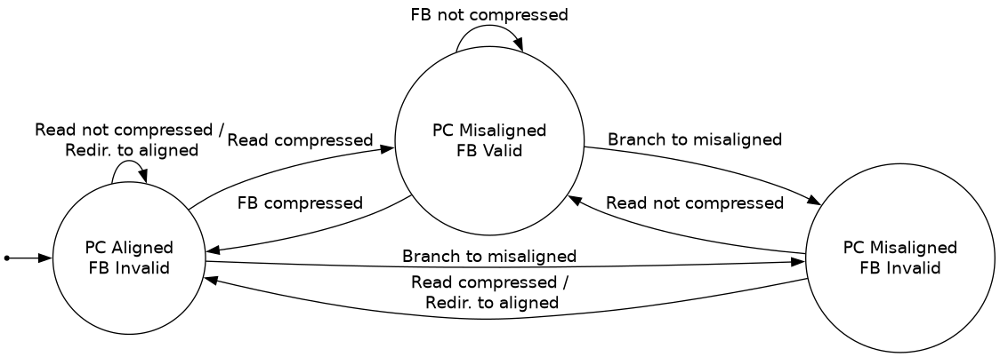
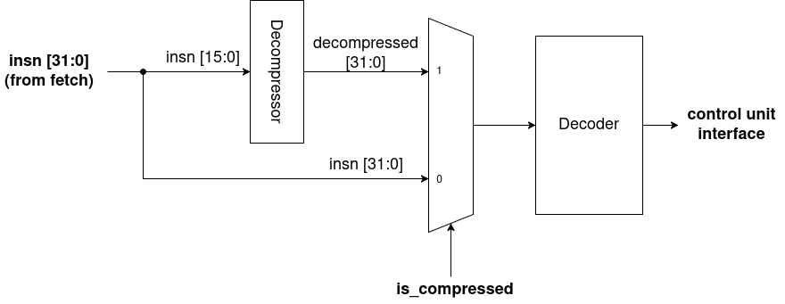

# RV32C

The RV32C extension allows some common instructions to be expressed as a 16b instruction. These 16b instructions may be freely mixed with 32b instructions. 

## Implementation Status
Currently, the implementation covers the "C" extension, including the "Zfa" and
"Zfd" subsets (decode-only). "Zcb" will be implemented in the near future.

The implementation is split into 2 components: the fetch buffer and the decompressor. 

## Fetch Buffer
The fetch buffer sits in front of the I$. It has 2 functions: 
1. Determine the next fetch address. The I$ supports only aligned 32b accesses, so the fetch buffer translates misaligned PC to the aligned address of the relevant data.
2. Buffer unused data. If an I$ fetch yields a compressed instruction, the remaining 16b are buffered as they belong to either another compressed instruction, or are part of a full-size instruction.

The fetch buffer forms an FSM (Mealy) from the PC alignment (`pc[1]`) and the fetch buffer valid bit (`fb.valid`). The state transition diagram is as follows:

In this diagram, "read compressed" indicates the next instruction is a compressed instruction read from the I$. "FB compressed" means the next instruction is a compressed instruction that was held in the fetch buffer.

Note that the 4th combination, a valid fetch buffer and aligned PC, is not possible.

## Decompressor
As all implemented instructions are 1:1 with full-sized instructions, the decompressor simply sits in front of the normal decoder. The decompressor takes in 16b of an instruction and outputs the corresponding 32b instruction.

