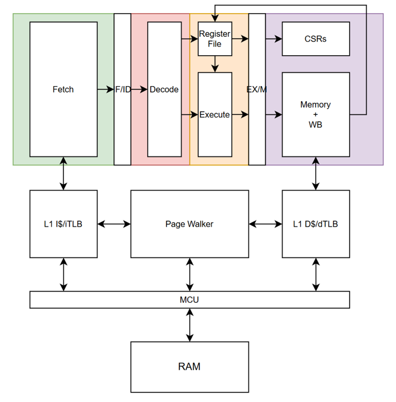
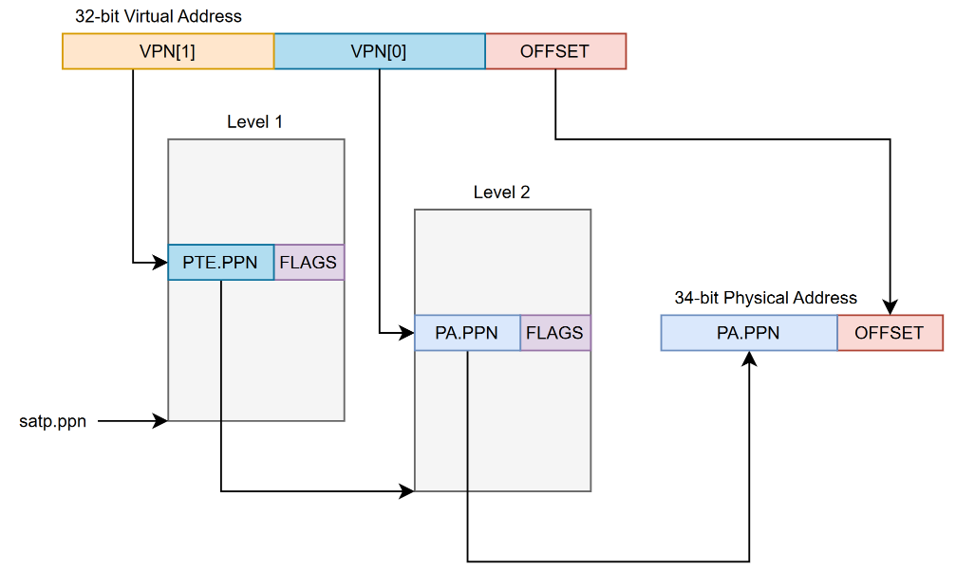
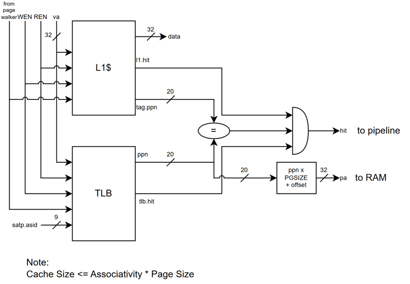
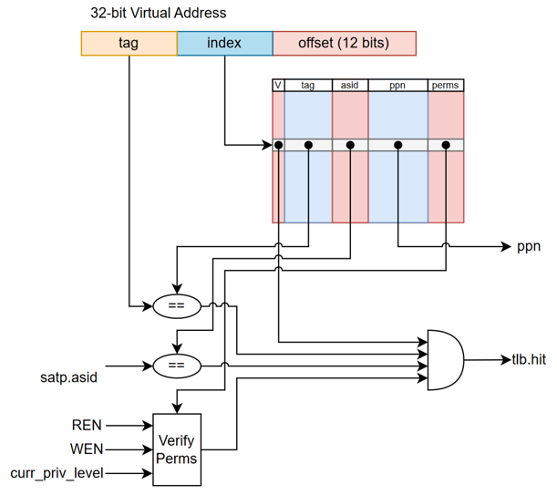
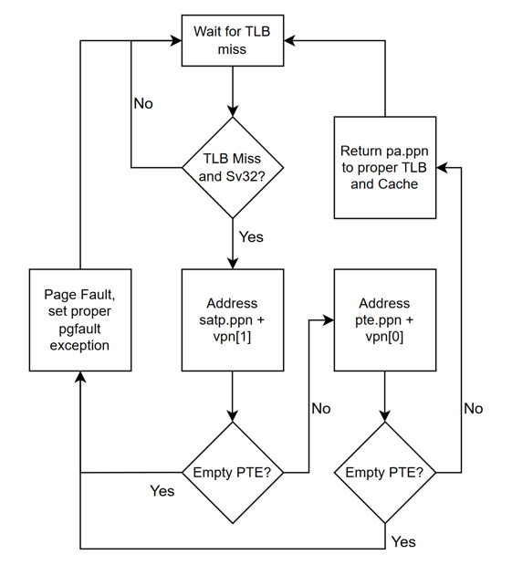

# RISC-V Supervisor Extension Overview

## Introduction

RISCVBusiness supports the RISC-V "S" Supervisor Extension. We implement the base extension as outlined in the privilege specification, along with a translation lookaside buffer (TLB), hardware page walker (PW), and a virtually indexed, physically tagged L1 cache (VIPT L1$) to with the goal of running an operating system on the processor in the future.

## Background

Supervisors, also known as operating systems (OS), are privileged programs that interface between user-programs and the hardware it runs on. These programs introduce important functionalities, such as paging/page tables, virtualized address spaces, and address translation. Paging splits memory up into manageable chunks. In RISC-V's case, pages are 4KB in size. During the start up of an OS, page tables are defined in memory. These tables store the translations for virtual addresses to physical addresses. In order to easily support this, a register is designated to storing the pointer to the page table of a current process. A virtualized address spaces, or virtual memory, is assigned to each running process by the operating system. These address spaces are private for a given process, so no other process will be able to directly edit another process' address space. However, in order for virtual memory to be possible, the pages of a virtual address space need to be mapped to physical pages. These physical page mappings are what's stored in a processes page table. Through the process of address translation, a virtual address can be converted to a physical address. This physical address is then what addresses main memory. The amount of physical pages depends on how much physical memory a processor has.

The 32-bit RISC-V "S" Supervisor Extension adds 11 new Control and Status Registers (CSRs), 1 instruction, a 32-bit virtualized address space (Sv32), and two-level address translation. Some of the CSRs are subsets of machine mode CSRs.

## Architecture

### Pipeline

It is based on the 3-stage pipeline from the multi-core branch, featuring the following stages:
- Fetch
- Decode and Execute
- Memory and Write Back

Visually, the decode and execute stages are made different colors, but occur in the same pipeline stage. This was done out of consideration for the vector extension, which is close to being integrated in to the pipeline. The functionality of our design should not wildly differ between a 3- or 4-stage pipeline.

### Two Level Address Translation

Two-level address translation will operate as shown in the above image. It shows how a 32-bit virtual address is split up into two virtual page numbers (VPN[1] and VPN[0]), and offset. The first stage of address translation uses VPN[1] to index the base page table referenced in the `satp.ppn` control and status register. The resul of this operation is getting a page table entry (PTE) that contains a physical page number to be used in the next level of address translation. VPN[0] indexes the physical page from the level 1 PTE, where the level 2 PTE contants the physical page number for the translated virtual address. This physical page number is prepended to the offset from the virtual address to create the physical address. 

### Virtually Indexed, Physically Tagged (VIPT) L1 TLB and Cache

The L1 cache and Translation Lookaside Buffer (TLB) are accessed in parallel, opting for a virtually indexed, physically tagged (VIPT) cache design. The total amount of data stored in a cache must not exceed the produce of the cache associativity and page size (4KB) for a VIPT design to function without experiencing aliasing.

### Translation Lookaside Buffer

The TLB stores the physical page number for a virtual page alongside the permissions of the page and an Address Space Identifier (ASID). When the TLB is accessed, the page permissions and ASID are checked against the current state of the RISC-V processor. If the ASID doesn't match or the valid bit is not set, a TLB miss is raised. If the permissions are not correct, a page fault is raised.

### Hardware Page Walker

A hardware page walker is used to walk pages without the extra bits software page walks would add. Here is the process that it follows

1. Wait for a TLB miss to occur in the instruction or data L1 TLB's. If there is a TLB miss and 32-bit address translation is enabled (labelled Sv32 in the RISC-V specification), then we begin the first level of address translation.
2. The page walker will address the value stored in `satp.ppn` indexed by VPN[1]. If the value received is an empty page table entry, a page fault is raised. If not, we are at the last level of address translation if any of the read, write, or execute permission bits are set. The physical page number in the PTE is the physical page for the physical address, which we will call `pa.ppn`, and we move on to step 4. Otherwise, we continue on the the next level of address translation using the physical page number in the PTE, which we will call `pte.ppn`.
3. The page walker will address the values stored in `pte.ppn` indexed by VPN[0]. If the value received is an empty page table entry, a page fault is raised. If not, we are at the last level of address translation. If the read, write, and execute bits are not set or the permission bits are not allowed by the specification, a page fault is raised. Otherwise, the physical page number in the page table entry is valid and it is the physical page for the physical address, which we will call `pa.ppn`, and we move on to step 4.
4. Return `pa.ppn` to the proper TLB and Cache. Go back to step 1.

## Contibutors

- William Cunningham (wrcunnin@purdue.edu)
- William Milne (milnew@purdue.edu)
- Kathy Niu (niu59@purdue.edu)