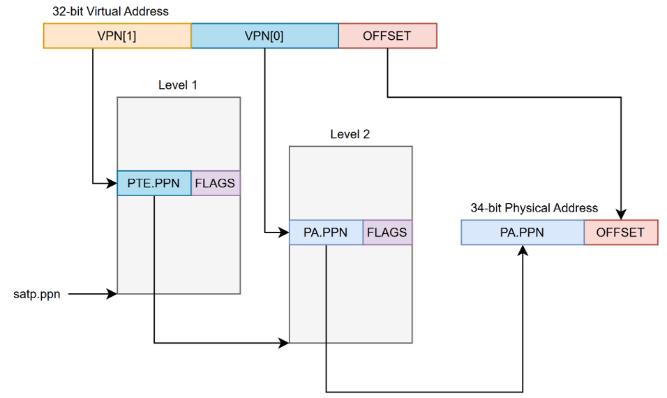

# RISC-V Supervisor Extension Overview

## Introduction

This project aims to integrate the RISC-V "S" Supervisor Extension in to SoCET's RISC-V processor. This project implements the base extension as outlined in the privilege specification, along with a translation lookaside buffer (TLB), hardware page walker (PW), and a virtually indexed, physically tagged L1 cache (VIPT L1$) to with the goal of running an operating system on the processor.

## Background

Supervisors, also known as operating systems (OS), are privileged programs that interface between user-programs and the hardware it runs on. These programs introduce important functionalities, such as paging/page tables, virtualized address spaces, and address translation. Paging splits memory up into manageable chunks. In RISC-V's case, pages are 4KB in size. During the start up of an OS, page tables are defined in memory. These tables store the translations for virtual addresses to physical addresses. In order to easily support this, a register is designated to storing the pointer to the page table of a current process. A virtualized address spaces, or virtual memory, is assigned to each running process by the operating system. These address spaces are private for a given process, so no other process will be able to directly edit another process' address space. However, in order for virtual memory to be possible, the pages of a virtual address space need to be mapped to physical pages. These physical page mappings are what's stored in a processes page table. Through the process of address translation, a virtual address can be converted to a physical address. This physical address is then what addresses main memory. The amount of physical pages depends on how much physical memory a processor has.

The 32-bit RISC-V "S" Supervisor Extension adds 11 new Control and Status Registers (CSRs), 1 instruction, a 32-bit virtualized address space (Sv32), and two-level address translation. Some of the CSRs are subsets of machine mode CSRs.

## Architecture

Below is a high level overview of our proposed pipeline architecture.

It is based on the 3-stage pipeline from the multi-core branch, but with a split (only visually, not actually) decode and execute stage. This was done out of consideration for the vector extension, which is close to being integrated in to the pipeline. The functionality of our design should not wildly differ between a 3- or 4-stage pipeline.

Two-level address translation will operate as shown in the below image.

The L1 cache and TLB will be accessed in parallel. This means we opted for a virtually indexed, physically tagged (VIPT) cache design. The cache size must not be larger than it's associativity multiplied by the page size (4KB) for a VIPT design to work without aliasing.

The TLB will be store the physical page number for a virtual page along with its permissions. TLB entries are matched against the stored address space identifier (ASID), a unique value for each program, along with the tag for the cache access.

A hardware page walker is used to walk pages without the extra bits software page walks would add. Below is the general flow that our page walker uses to determine if two-level address translation is completed.

## Status

As of December 2024, the TLB, PW, VIPT L1$, and CSRs + interrupt/exception handling have all been implemented into the processor. We feel the core at its current state needs to undergo extensive verification before we can consider proceeding with adding the hypervisor extension, which is why we are deciding not to move forward with implementing the hypervisor for Spring 2025.

## Future Work

Instead, we will verify that the supervisor extension works in it entirety as a single-core using SystemVerilog test benches and S-Mode unit tests. Then, get it working as a multi-core. Once both single-core and multi-core function is perfected, we will get an operating system running on the processor and flash the design to an FPGA to have a "physical" deliverable. We also intend to perform a synthesis run of the design using the SkyWater 130nm PDK to determine the max operating frequency, power consumption, and area for the design. After this, the Spring semester will be completed, and we should have a solid supervisor implemented for this RISC-V core. The next steps would be implementing the Hypervisor extension for those brave enough.

## Contibutors

- William Cunningham (wrcunnin@purdue.edu)
- William Milne (milnew@purdue.edu)
- Kathy Niu (niu59@purdue.edu)